# React-shop-cloudfront

## Task 5 - Integration with S3

URL of instructions: https://github.com/rolling-scopes-school/aws/blob/main/aws-developer/05_integration_with_s3/task.md

Code is separated in 2 repositories:
  - frontend (https://github.com/akiavara/nodejs-aws-shop-react)
  - backend (https://github.com/akiavara/aws-shop-react-backend)

What has been done:
  - [x] Code of the backend repository in MR : https://github.com/akiavara/aws-shop-react-backend/pull/4
  - [x] URL of frontend application: https://d1ef84ecychojy.cloudfront.net
  - [x] Task 5.1: S4 bucket manually created (called "import-service-dev-shop-react") with 2 folders inside ("parsed" and "uploaded"). import-service created in backend repository : https://github.com/akiavara/aws-shop-react-backend/pull/4/files
  - [x] Task 5.2: See importProductsFile lambda function here: https://github.com/akiavara/aws-shop-react-backend/pull/4/files#diff-6708ee305f27d7ad5c77f3d37c5ff9c5bf88d5ed9718918092076dc49d1e94ea
  - [x] Task 5.3: See importFileParser lambda function here: https://github.com/akiavara/aws-shop-react-backend/pull/4/files#diff-cba809526322ecdd303bc91ee3144b584567ad5eb84937af93e0a6427debe137
  - [x] Task 5.4: This MR and the MR in backend repository prove that it's ok
  - [x] +10 (All languages) - importProductsFile lambda is covered by unit tests. See unit tests for importProductsFile in backend MR (see also the screenshot below) : https://github.com/akiavara/aws-shop-react-backend/pull/4/files#diff-0f87bcaaf945db6dc5b2e3669f95bc2d26d789231ea6f8eddb350824e8745d37
  - [x] +10 (All languages) - importFileParser lambda is covered by unit tests. See unit tests for importFileParser in backend MR (see also the screenshot below) : https://github.com/akiavara/aws-shop-react-backend/pull/4/files#diff-be2369e6d4675c74c6c910847cdc696c949f79e27ed73db9a40ddc5f8bf6b1ec
  - [x] +10 (All languages) - At the end of the stream the lambda function should move the file from the uploaded folder into the parsed folder : https://github.com/akiavara/aws-shop-react-backend/pull/4/files#diff-cba809526322ecdd303bc91ee3144b584567ad5eb84937af93e0a6427debe137R74-R101


1. Task 5.1. Creation of the S4 bucket
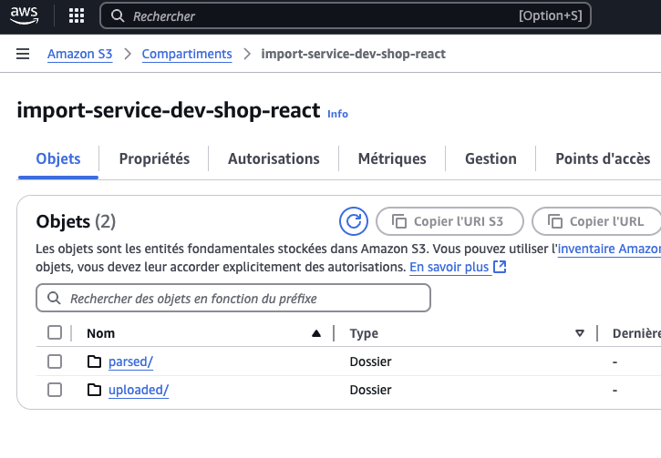

I have also added CORS config:

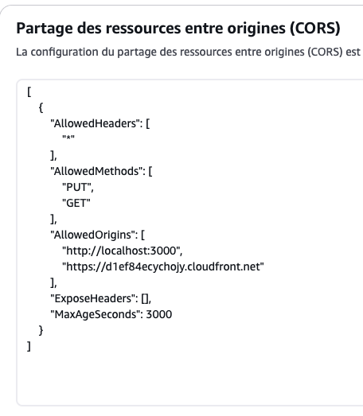

2. Task 5.2 and 5.3: make it work with storefront

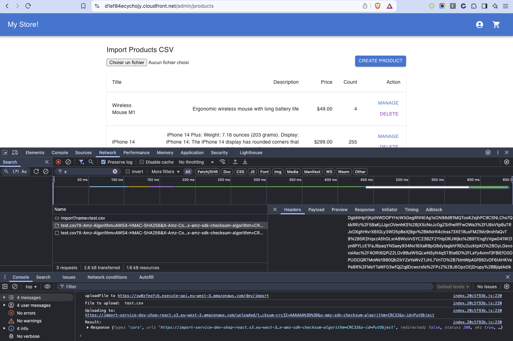

3. Task 5.3. Logs from importFileParser
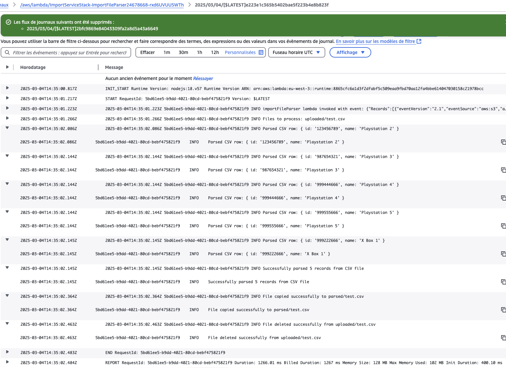


## Task 4 - Integration with NoSQL Database

URL of instructions: https://github.com/rolling-scopes-school/aws/blob/main/aws-developer/04_integration_with_nosql_database/task.md

What has been done:
  - [x] Code is separated in 2 repositories: frontend (https://github.com/akiavara/nodejs-aws-shop-react) and backend (https://github.com/akiavara/aws-shop-react-backend)
  - [x] Code of the backend repository in MR : https://github.com/akiavara/aws-shop-react-backend/pull/3
  - [x] URL of API: https://1tmvuptf84.execute-api.eu-west-3.amazonaws.com/dev/products
  - [x] URL of frontend application: https://d1ef84ecychojy.cloudfront.net
  - [x] Task 4.1: You can populate the database automatically ("$ npm run seed", file "scripts/seed-data.ts" in backend repository) - see screenshot below to see the result
  - [x] Task 4.2.1: Environment variables are sent to Lambda functions, see "tableEnvironment" variable in backend repo file "[product-service/lib/product-service-stack.ts](https://github.com/akiavara/aws-shop-react-backend/pull/3/files#diff-6407901d1857623807a761aad4d0db9f8dfefe38b7929a2576422632653f0056)"
  - [x] Tasks 4.2.2 + 4.2.3 + 4.2.4 : See functions ```getProducts``` and ```getProductById``` in "[product-service/src/services/productService.ts](https://github.com/akiavara/aws-shop-react-backend/pull/3/files#diff-7988b6eea10c32ff6de02f91f668bf3eab787f2e7816b9d87e4ee76d2abcfdcb)" (backend repository) to see product retrieval via database (and models join). I also changed types (for product model and count) ```product-service/src/types/index.ts```
  - [x] Task 4.3: createProduct Lambda created, url "/products" via POST
  - [x] Task 4.4: MR done (for frontend and backend repositories) + README update
  - [x] POST ```/products``` lambda functions returns error 400 status code if product data is invalid -> see Lambda function defined in file ```product-service/src/functions/createProduct/index.ts``` in backend repository
  - [x] All lambdas return error 500 status code on any error (DB connection, any unhandled error in code) -> see all Lambda functions under ```product-service/src/functions``` folder in backend repository
  - [x] All lambdas do console.log for each incoming requests and their arguments -> see all Lambda functions under ```product-service/src/functions``` folder in backend repository (there is console.log at the beginning of each)
  - [x] Transaction based creation of product -> See the transaction in ```product-service/src/functions/createProduct/index.ts``` in backend repository (https://github.com/akiavara/aws-shop-react-backend/pull/3/files#diff-f48bbb047be10782b85ca9fc481423fef2aca321a5918199a3592f3a87c7199b)
  - [x] I did it using CDK, not serverless (no penalties)
  - [x] I also changed the ```product-service/swagger.yaml``` file in order to add the createProduct method (https://github.com/akiavara/aws-shop-react-backend/pull/3/files#diff-5994bb86a5ca1d57473103bc0729822da6890f02d70fa34e5ae9f451b5962bb4)

Here are screenshots of what I did.

1. Automatic database filling

When we launch:
```$ npm run seed```

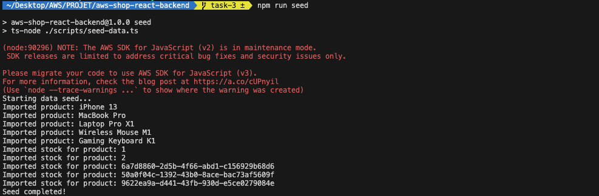

2. POST /products

When we POST a new product (bore and after):

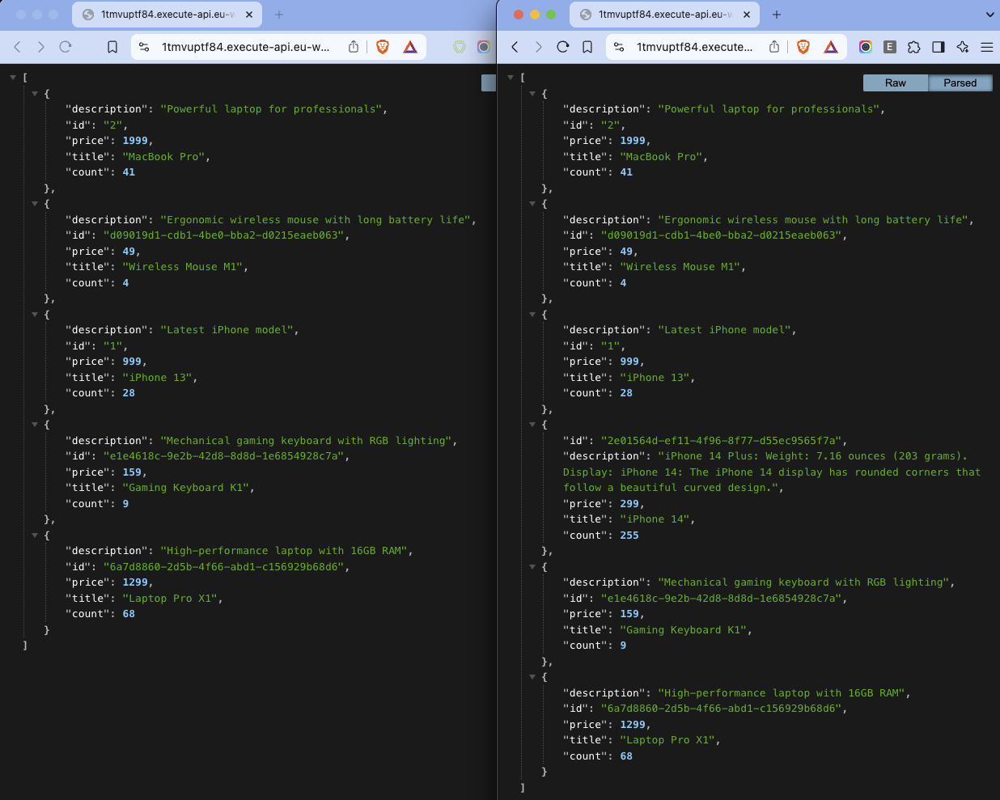


## Task 3 - Lambda + serverless

URL of instructions: https://github.com/rolling-scopes-school/aws/blob/main/aws-developer/03_serverless_api/task.md

What has been done:
  - [x] Code is separated in 2 repositories: frontend (https://github.com/akiavara/nodejs-aws-shop-react) and backend (https://github.com/akiavara/aws-shop-react-backend)
  - [x] Code of the backend repository in MR (https://github.com/akiavara/aws-shop-react-backend/pull/1/files)
  - [x] getProductsList lambda function: https://1tmvuptf84.execute-api.eu-west-3.amazonaws.com/dev/products
  - [x] getProductsById lambda function: https://1tmvuptf84.execute-api.eu-west-3.amazonaws.com/dev/products/2
  - [x] getProductsById error handled if product not found : https://1tmvuptf84.execute-api.eu-west-3.amazonaws.com/dev/products/2222
  - [x] Swagger file is in "aws-shop-react-backend" repository "aws-shop-react-backend/product-service/swagger.yaml"
  - [x] Unit tests in backend repository

Here are screenshots of what I did.

1. Unit tests in backend repo


2. Deployment result in backend repo

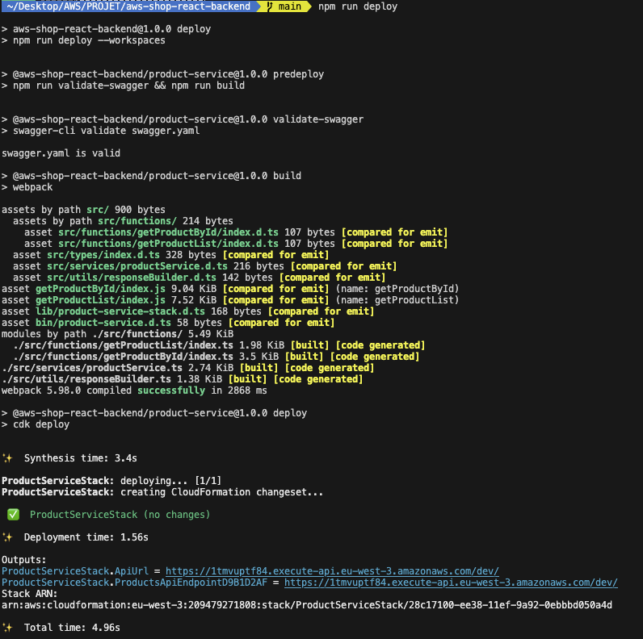

3. Display in "API Gateway" AWS

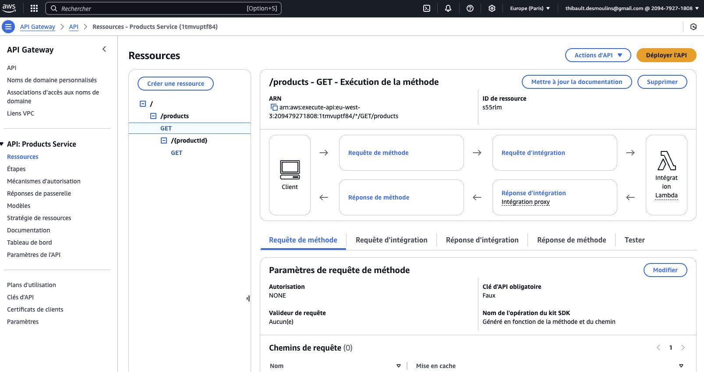

4. Local website display

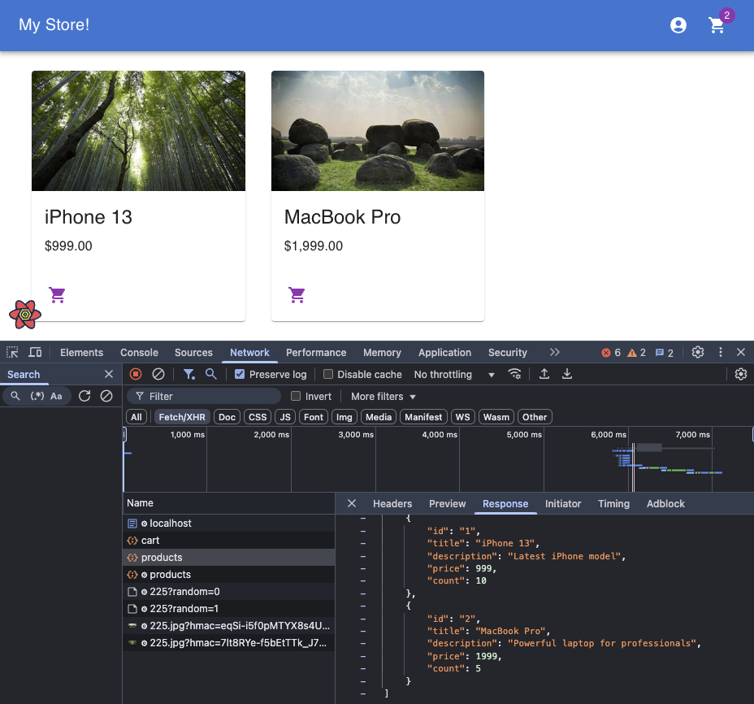

## Task 2 - Serving SPA

URL of instructions: https://github.com/rolling-scopes-school/aws/blob/main/aws-developer/02_serving_spa/task.md

What has been done:
  - [x] Manual Bucket + CloudFront creation: done
  - [x] Automatic Bucket + CloudFront creation: done

Manual creation
- Bucket URL (Access Denied): https://nodejs-aws-shop-react-tds.s3.eu-west-3.amazonaws.com/
- CloudFront URL: https://djy4jsds0nb88.cloudfront.net/

Automatic creation (using CDK)
- Bucket URL (Access Denied, see "infrastructure/lib/infrastructure-stack.ts") : https://webappstack-jsccstaticbucket131261f3-sipylym7kxvi.s3.eu-west-3.amazonaws.com/
- CloudFront URL: https://d1ef84ecychojy.cloudfront.net

Here are screenshots of what I did.

1. Buckets configuration

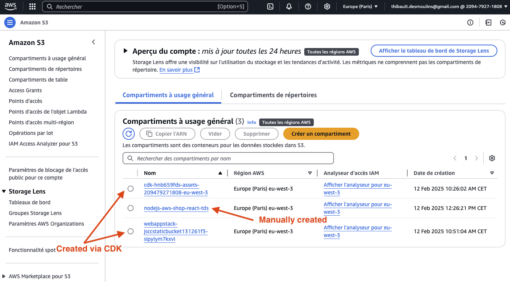

2. Cloudfront configuration

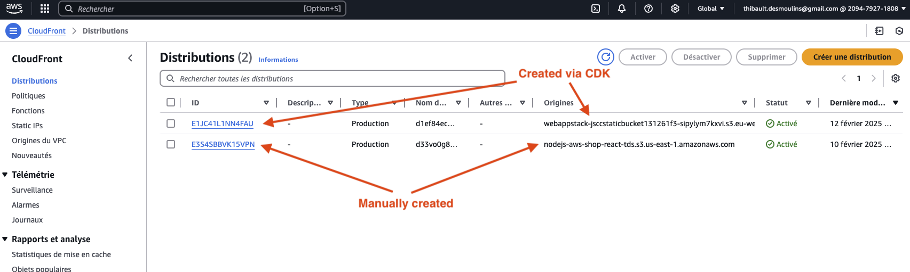

3. CDK Bootstrap command line output

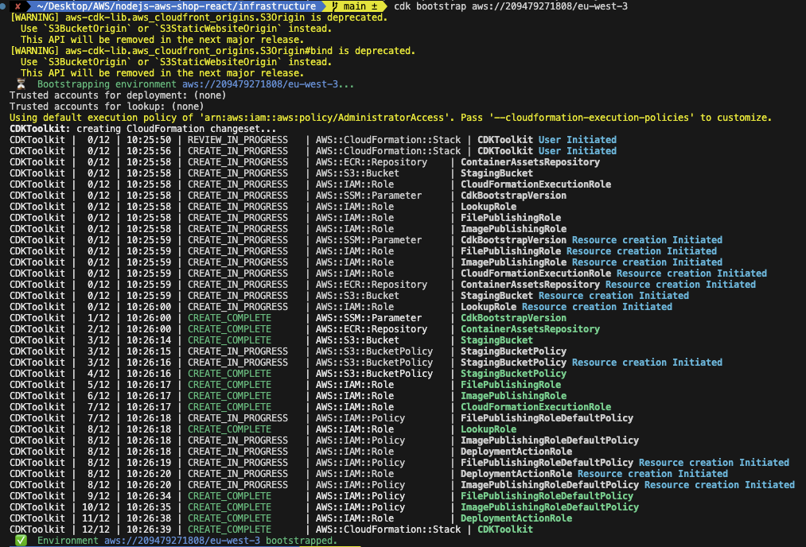

4. CDK Deploy command line output

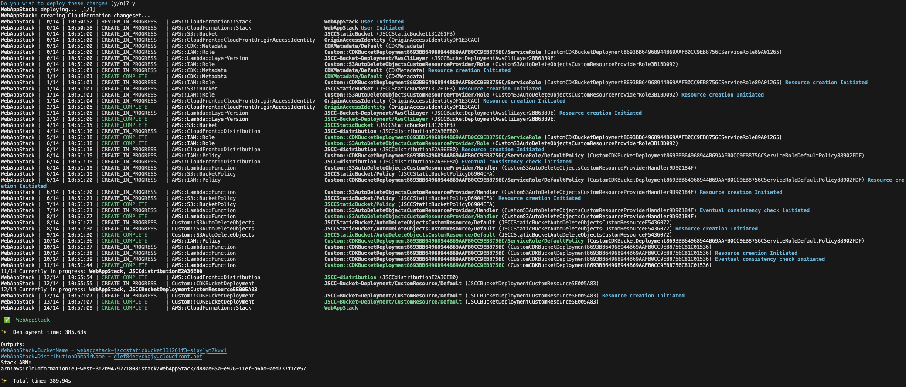


## Old README

This is frontend starter project for nodejs-aws mentoring program. It uses the following technologies:

- [Vite](https://vitejs.dev/) as a project bundler
- [React](https://beta.reactjs.org/) as a frontend framework
- [React-router-dom](https://reactrouterdotcom.fly.dev/) as a routing library
- [MUI](https://mui.com/) as a UI framework
- [React-query](https://react-query-v3.tanstack.com/) as a data fetching library
- [Formik](https://formik.org/) as a form library
- [Yup](https://github.com/jquense/yup) as a validation schema
- [Vitest](https://vitest.dev/) as a test runner
- [MSW](https://mswjs.io/) as an API mocking library
- [Eslint](https://eslint.org/) as a code linting tool
- [Prettier](https://prettier.io/) as a code formatting tool
- [TypeScript](https://www.typescriptlang.org/) as a type checking tool

### Available Scripts

#### `start`

Starts the project in dev mode with mocked API on local environment.

#### `build`

Builds the project for production in `dist` folder.

#### `preview`

Starts the project in production mode on local environment.

#### `test`, `test:ui`, `test:coverage`

Runs tests in console, in browser or with coverage.

#### `lint`, `prettier`

Runs linting and formatting for all files in `src` folder.
