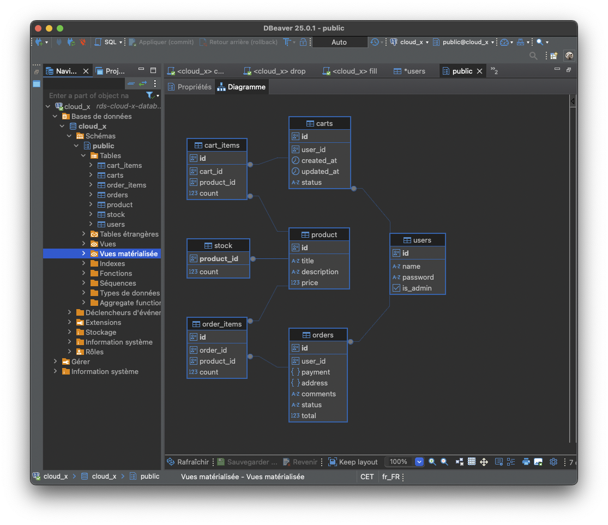
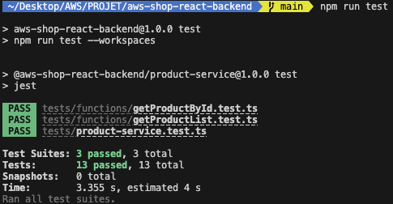

# React-shop-cloudfront

## Task 10 - Backend For Frontend

URL of instructions: https://github.com/rolling-scopes-school/aws/blob/main/aws-developer/10_backend_for_frontend/task.md

Code is separated in 3 repositories now:
- frontend (https://github.com/akiavara/nodejs-aws-shop-react)
- backend (https://github.com/akiavara/aws-shop-react-backend)
- fork of nodejs-aws-cart-api (https://github.com/akiavara/nodejs-aws-cart-api)

Pull requests:
- frontend : this one (https://github.com/akiavara/nodejs-aws-shop-react/pull/10)
- backend : https://github.com/akiavara/aws-shop-react-backend/pull/7
- fork of nodejs-aws-cart-api : no PR for this task

Tests:
- URL of frontend application where you can test: https://d4hva5vucegt5.cloudfront.net
- If you check my frontend app API calls (using chrome devtools) you will see that every queries goes to "https://d2xanes5oeu9gx.cloudfront.net" (my bff URL)
- To use my frontend app (if you don't have a local storage item for authentication) click on the login icon, click "Login", enter "johndoe" as username, "TEST_PASSWORD" as password and login
- Now that you are logged in you will be able to
   - add to cart
   - create product / upload a file to create multiple products
   - place an order
   - see your orders
   - logout
- You can also login using username "User 2" and password "TEST_PASSWORD". This user is not an admin so you can't see the product creation
- You can also register if you want (be careful I don't hash passwords in the DB so don't use real password)

What has been done:
- [x] Task 10.1:
   - Create a new service called bff-service (see backend pull request, URL of dockerfile in this PR: )
   - EB app that listens for all requests and redirects those requests to the appropriate services based on variables provided by the .env file (see file "bff-service-stack" that create the EB and send env variables: https://github.com/akiavara/aws-shop-react-backend/pull/7/files#diff-23880ac77782a4fba7d3e1ec4fa7c0b00f647b4a6aad96684f61da9942527cbc)
   - If BFF Service cannot find recipientURL by the {recipient-service-name}, return a "Cannot process request" error message with status 502. See the content of my BFF which is the file "bff-service/src/index.ts" (https://github.com/akiavara/aws-shop-react-backend/pull/7/files#diff-3789daa082ef28ec04d27e3969066f012320e6be43b41c453202144edfdc1844) line 42 and also line 142
   - BFF Service should return the same status code and error message that the recipient service returns to the BFF Service in case of any error on the recipient service side. Same here, see the content of my BFF which is the file "bff-service/src/index.ts" (https://github.com/akiavara/aws-shop-react-backend/pull/7/files#diff-3789daa082ef28ec04d27e3969066f012320e6be43b41c453202144edfdc1844) from line 113 (with the JS comment "// Forward the request" and then "// Forward the response")
- [x] Task 10.2: Deploy BFF Service with Elastic Beanstalk (see screenshot below)
- [x] Task 10.3: This PR
- [X] optional - Add a cache at the BFF Service level for a request to the getProductsList lambda function of the Product Service. The cache should expire in 2 minutes.
   - I have added a in-memory cache, you can see the code in the BFF code (still here https://github.com/akiavara/aws-shop-react-backend/pull/7/files#diff-3789daa082ef28ec04d27e3969066f012320e6be43b41c453202144edfdc1844)
   - In this file check for "Cache object to store responses" comment -> array initialization
   - See "// Check if the request is for products and handle caching" comment to see where I handle caching (if cache not expired I return the cache content, else I query the backend service and cache the response before returning the answer)
   - Sorry the BFF code for this part is not clean I could refactor it (I use the same code for request forwarding in cache "if" bloc and also for other services) but it's working fine for this task :)

By the way you can also find my 2 docker images that I host in docker hub (for BFF and Cart API) here: https://hub.docker.com/search?q=akiavara, I will remove them once the training ends.

1. BFF EB Env

2. Cloudfront distributions

## Task 9 - Docker and AWS Elastic Beanstalk

URL of instructions: https://github.com/rolling-scopes-school/aws/blob/main/aws-developer/09_containerization/task.md

Code is separated in 3 repositories now (due to the task a 3rd repository has been added):
- frontend (https://github.com/akiavara/nodejs-aws-shop-react)
- backend (https://github.com/akiavara/aws-shop-react-backend)
- fork of nodejs-aws-cart-api (https://github.com/akiavara/nodejs-aws-cart-api)

Pull requests:
- frontend : this one (https://github.com/akiavara/nodejs-aws-shop-react/pull/9)
- backend : no PR for this task
- fork of nodejs-aws-cart-api (https://github.com/akiavara/nodejs-aws-cart-api/pull/2)

What has been done:

- [x] URL of frontend application: https://d4hva5vucegt5.cloudfront.net
- [x] Task 9.1:
   - I have created and published my docker image in Docker Hub. You can find it here (https://hub.docker.com/repository/docker/akiavara/cart-api). This image is optimize and have a size < 150 MB (see screenshot below).
   - In the .dockerignore file some big folders are excluded ("node_modules" and "cdk.out" are the biggest ones, they are used for development but my app is compiled using webpack so it doens't need it)
- [x] Task 9.2:
   - Elastic Beanstalk app created (see screeshots below), this last uses the Dockerfile and here is the final URL: http://akiavara-cart-api-prod.eba-pfajgpsk.eu-west-3.elasticbeanstalk.com
   - Frontend app updated (apiPaths file)
- [x] +15 - Environment is created and the app is deployed to the AWS cloud. You must provide a link to your GitHub repo with Cart Service API or PR with created Dockerfile and related configurations.
- [x] +15 - FE application is updated with Cart API endpoint. You must provide a PR with updates in your FE repository and OPTIONALLY link to deployed front-end app which makes proper API calls to your Cart Service.

1. Docker image size

2. Elastic Beanstalk app

Application:

Details:

## Task 8 - Authorization

URL of instructions: https://github.com/rolling-scopes-school/aws/blob/main/aws-developer/08_integration_with_sql_database/task.md

Code is separated in 3 repositories now (due to the task a 3rd repository has been added):
- frontend (https://github.com/akiavara/nodejs-aws-shop-react)
- backend (https://github.com/akiavara/aws-shop-react-backend)
- fork of nodejs-aws-cart-api (https://github.com/akiavara/nodejs-aws-cart-api)

Pull requests:
- frontend : this one (https://github.com/akiavara/nodejs-aws-shop-react/pull/8)
- backend : no PR for this task
- fork of nodejs-aws-cart-api (https://github.com/akiavara/nodejs-aws-cart-api/pull/1)

What has been done:

- [x] URL of frontend application: https://d4hva5vucegt5.cloudfront.net
- [x] Task 8.1: You can see my fork of nodejs-aws-cart-api in above links.
   - Public URL: https://45jb31lr7j.execute-api.eu-west-3.amazonaws.com/prod/
   - Example https://45jb31lr7j.execute-api.eu-west-3.amazonaws.com/prod/products
- [x] Task 8.2: RDS database created on AWS console (PostgreSQL), see screenshot below. SQL files:
   - Create database tables: https://github.com/akiavara/nodejs-aws-cart-api/pull/1/files#diff-20398a22ddd48d908944ac4de0ee87018a569418c69f7d83c310e4aec2d3b503
   - Drop all tables: https://github.com/akiavara/nodejs-aws-cart-api/pull/1/files#diff-99bbb763451e41eb09c25a6ab0ffde23053acdb4f77d6e39ba8e2e9d64e51f1b
   - Fill tables with samples data: https://github.com/akiavara/nodejs-aws-cart-api/pull/1/files#diff-d4d112c651c8a3bad60792314472888e1ca299c66ceba721893b03bfbb7068cd
- [x] Task 8.3: Nestjs app updated in order to use RDS, frontend app constant updated too in order to use this Nestjs app
- [x] +20 (All languages) - Create orders table and integrated with it Order model:
   - Order model : https://github.com/akiavara/nodejs-aws-cart-api/pull/1/files#diff-cba09e05b4d5ef91e1de8759e1770f67699707b896bc1034ada0f0255264e503
   - Order items model : https://github.com/akiavara/nodejs-aws-cart-api/pull/1/files#diff-8e2602233963e10cbe6df7b8ae2295688d66c92134a3afd43097e0d4ba349ab5
   - Order service to use these models: https://github.com/akiavara/nodejs-aws-cart-api/pull/1/files#diff-5826031ecf74a3db1f74cbca740fb5173eef6200a4de41471fbb9238be772287
- [x] +4 (All languages) - Create users table and integrate with it
   - See create.sql file above where table is created
   - See [auth.service.ts](https://github.com/akiavara/nodejs-aws-cart-api/pull/1/files#diff-aea62a4c305374791411369a46e8553d716a032a03bb48136176873887e3311c) for authentication management
- [x] +3 (All languages) - Transaction based creation of checkout. [See lines 42 to 78 of src/order/services/order.service.ts](https://github.com/akiavara/nodejs-aws-cart-api/pull/1/files#diff-5826031ecf74a3db1f74cbca740fb5173eef6200a4de41471fbb9238be772287R42-R78)
- [x] +3 (All languages) - Integrate Cart service with FE repository
- [x] I couldn't understand very well what was expected for this task so I think I had done 100x more than expected but I didn't like to
have a non-functional website. So if you go to my app (https://d4hva5vucegt5.cloudfront.net) you:
   - will see a menu "Login / register" if you have no authorization_token in your local storage
   - if you go to Login you can use credentials seen in the "fill.sql" file, you can use "johndoe" and "TEST_PASSWORD" to be an admin
   - you can also register if you want
   - once logged in you can add to cart / see your orders
   - you can logout
   - as only "johndoe" can upload a file in order to add products (previous tasks) this account is the only one that can see "Manage products" page

1. RDS database

Database in AWS console:

SQL that I used to generate tables

Visual representation of tables

2. Whole storefront presentation

## Task 7 - Authorization

URL of instructions: https://github.com/rolling-scopes-school/aws/blob/main/aws-developer/07_authorization/task.md

Code is separated in 2 repositories:

- frontend (https://github.com/akiavara/nodejs-aws-shop-react)
- backend (https://github.com/akiavara/aws-shop-react-backend)

What has been done:

- [x] Code of the backend repository in MR : https://github.com/akiavara/aws-shop-react-backend/pull/6
- [x] URL of frontend application: https://d4hva5vucegt5.cloudfront.net
- [x] Task 7.1: [authorization-service created with basicAuthorizer](https://github.com/akiavara/aws-shop-react-backend/pull/6/files#diff-78f5e43aea18a609e4d8ec9337b409feec2fea041e9bf6d71234acf38724c917). This last returns IAM policy if given credentials are correct. ".env" file with "CREDENTIALS=johndoe=TEST_PASSWORD" inside.
- [x] Task 7.2: Add Lambda authorization to the "/import" path of the Import Service API Gateway and use it at as the Lambda authorizer. See changes in import-service-stack: import-service/lib/import-service-stack.ts
- [x] Task 7.3: Frontend app calls "/import" with Authorization header based on "authorization_token" local storage item (see https://github.com/akiavara/nodejs-aws-shop-react/pull/7/files#diff-24432b1f8209e7604bd55964d5a41321169ae306bbaa65064d4ed9a03fdd4d2f). To test it you can enter this command in your Chrome / Firefox console: `localStorage.setItem('authorization_token', 'am9obmRvZTpURVNUX1BBU1NXT1JE');`
- [x] I have also updated [the swagger file that you can find here](https://github.com/akiavara/aws-shop-react-backend/pull/6/files#diff-1b43ab733850c54f485ab1af1ac53a80a04a82d9432fe32d4e99a388ddc6143d), you can use it with the authorization code "Basic am9obmRvZTpURVNUX1BBU1NXT1JE" which is "johndoe:TEST_PASSWORD"
- [x] +30 pts if client display alerts if unauthorized (see screenshot below)

1. Authorization lambda
   

2. Test using swagger
   First, authenticate in Swagger using "Basic am9obmRvZTpURVNUX1BBU1NXT1JE" (or with wrong credentials to test the unauthorized part)
   

Then call the "/import" method

3. Alert if unauthorized

## Task 6 - SQS & SNS

URL of instructions: https://github.com/rolling-scopes-school/aws/blob/main/aws-developer/06_async_microservices_communication/task.md

Code is separated in 2 repositories:

- frontend (https://github.com/akiavara/nodejs-aws-shop-react)
- backend (https://github.com/akiavara/aws-shop-react-backend)

What has been done:

- [x] Code of the backend repository in MR : https://github.com/akiavara/aws-shop-react-backend/pull/5
- [x] URL of frontend application: https://d4hva5vucegt5.cloudfront.net
- [x] Task 6.1: [Queue SQL catalogItemsQueue created](https://github.com/akiavara/aws-shop-react-backend/pull/5/files#diff-6407901d1857623807a761aad4d0db9f8dfefe38b7929a2576422632653f0056), this last call new [Lambda function catalogBatchProcess](https://github.com/akiavara/aws-shop-react-backend/pull/5/files#diff-8293a261821d2dd6b0a6909d658dcb2ae47b0a709c54f2d94976294d4b592da5) with 5 messages at once via batchSize property. Products are then created in database.
- [x] Task 6.2: importFileParser send CSV record into SQS (I kept the logging for convenience): see https://github.com/akiavara/aws-shop-react-backend/pull/5/files#diff-cba809526322ecdd303bc91ee3144b584567ad5eb84937af93e0a6427debe137
- [x] Task 6.3: SNS createProductTopic created (see https://github.com/akiavara/aws-shop-react-backend/pull/5/files#diff-6407901d1857623807a761aad4d0db9f8dfefe38b7929a2576422632653f0056) which send email to my professional email address and catalogBatchProcess call this SNS once products are created (see method sendSnsNotification here: https://github.com/akiavara/aws-shop-react-backend/pull/5/files#diff-8293a261821d2dd6b0a6909d658dcb2ae47b0a709c54f2d94976294d4b592da5)
- [x] +15 (All languages) - catalogBatchProcess lambda is covered by unit tests (see https://github.com/akiavara/aws-shop-react-backend/pull/5/files#diff-b22883024061cd3944f111dc43cfe95377ab5c5663ab40d168dfe92b16a95d6d)
- [x] +15 (All languages) - set a Filter Policy for SNS createProductTopic: see sendSnsNotification function and multiple "createProductTopic.addSubscription" here https://github.com/akiavara/aws-shop-react-backend/pull/5/files#diff-6407901d1857623807a761aad4d0db9f8dfefe38b7929a2576422632653f0056. It's my same professional email but I have added a "+expensive" for example to be sure that it's the correct subscription. See screens below to confirm.

1. Unit tests
   

2. Filter policy + SNS
   

## Task 5 - Integration with S3

URL of instructions: https://github.com/rolling-scopes-school/aws/blob/main/aws-developer/05_integration_with_s3/task.md

Code is separated in 2 repositories:

- frontend (https://github.com/akiavara/nodejs-aws-shop-react)
- backend (https://github.com/akiavara/aws-shop-react-backend)

What has been done:

- [x] Code of the backend repository in MR : https://github.com/akiavara/aws-shop-react-backend/pull/4
- [x] URL of frontend application: https://d4hva5vucegt5.cloudfront.net
- [x] Task 5.1: S4 bucket manually created (called "import-service-dev-shop-react") with 2 folders inside ("parsed" and "uploaded"). import-service created in backend repository : https://github.com/akiavara/aws-shop-react-backend/pull/4/files
- [x] Task 5.2: See importProductsFile lambda function here: https://github.com/akiavara/aws-shop-react-backend/pull/4/files#diff-6708ee305f27d7ad5c77f3d37c5ff9c5bf88d5ed9718918092076dc49d1e94ea
- [x] Task 5.3: See importFileParser lambda function here: https://github.com/akiavara/aws-shop-react-backend/pull/4/files#diff-cba809526322ecdd303bc91ee3144b584567ad5eb84937af93e0a6427debe137
- [x] Task 5.4: This MR and the MR in backend repository prove that it's ok
- [x] +10 (All languages) - importProductsFile lambda is covered by unit tests. See unit tests for importProductsFile in backend MR (see also the screenshot below) : https://github.com/akiavara/aws-shop-react-backend/pull/4/files#diff-0f87bcaaf945db6dc5b2e3669f95bc2d26d789231ea6f8eddb350824e8745d37
- [x] +10 (All languages) - importFileParser lambda is covered by unit tests. See unit tests for importFileParser in backend MR (see also the screenshot below) : https://github.com/akiavara/aws-shop-react-backend/pull/4/files#diff-be2369e6d4675c74c6c910847cdc696c949f79e27ed73db9a40ddc5f8bf6b1ec
- [x] +10 (All languages) - At the end of the stream the lambda function should move the file from the uploaded folder into the parsed folder : https://github.com/akiavara/aws-shop-react-backend/pull/4/files#diff-cba809526322ecdd303bc91ee3144b584567ad5eb84937af93e0a6427debe137R74-R101

1. Task 5.1. Creation of the S4 bucket
   

I have also added CORS config:

2. Task 5.2 and 5.3: make it work with storefront

3. Task 5.3. Logs from importFileParser
   

## Task 4 - Integration with NoSQL Database

URL of instructions: https://github.com/rolling-scopes-school/aws/blob/main/aws-developer/04_integration_with_nosql_database/task.md

What has been done:

- [x] Code is separated in 2 repositories: frontend (https://github.com/akiavara/nodejs-aws-shop-react) and backend (https://github.com/akiavara/aws-shop-react-backend)
- [x] Code of the backend repository in MR : https://github.com/akiavara/aws-shop-react-backend/pull/3
- [x] URL of API: https://88fi19k4tg.execute-api.eu-west-3.amazonaws.com/dev/products
- [x] URL of frontend application: https://d4hva5vucegt5.cloudfront.net
- [x] Task 4.1: You can populate the database automatically ("$ npm run seed", file "scripts/seed-data.ts" in backend repository) - see screenshot below to see the result
- [x] Task 4.2.1: Environment variables are sent to Lambda functions, see "tableEnvironment" variable in backend repo file "[product-service/lib/product-service-stack.ts](https://github.com/akiavara/aws-shop-react-backend/pull/3/files#diff-6407901d1857623807a761aad4d0db9f8dfefe38b7929a2576422632653f0056)"
- [x] Tasks 4.2.2 + 4.2.3 + 4.2.4 : See functions `getProducts` and `getProductById` in "[product-service/src/services/productService.ts](https://github.com/akiavara/aws-shop-react-backend/pull/3/files#diff-7988b6eea10c32ff6de02f91f668bf3eab787f2e7816b9d87e4ee76d2abcfdcb)" (backend repository) to see product retrieval via database (and models join). I also changed types (for product model and count) `product-service/src/types/index.ts`
- [x] Task 4.3: createProduct Lambda created, url "/products" via POST
- [x] Task 4.4: MR done (for frontend and backend repositories) + README update
- [x] POST `/products` lambda functions returns error 400 status code if product data is invalid -> see Lambda function defined in file `product-service/src/functions/createProduct/index.ts` in backend repository
- [x] All lambdas return error 500 status code on any error (DB connection, any unhandled error in code) -> see all Lambda functions under `product-service/src/functions` folder in backend repository
- [x] All lambdas do console.log for each incoming requests and their arguments -> see all Lambda functions under `product-service/src/functions` folder in backend repository (there is console.log at the beginning of each)
- [x] Transaction based creation of product -> See the transaction in `product-service/src/functions/createProduct/index.ts` in backend repository (https://github.com/akiavara/aws-shop-react-backend/pull/3/files#diff-f48bbb047be10782b85ca9fc481423fef2aca321a5918199a3592f3a87c7199b)
- [x] I did it using CDK, not serverless (no penalties)
- [x] I also changed the `product-service/swagger.yaml` file in order to add the createProduct method (https://github.com/akiavara/aws-shop-react-backend/pull/3/files#diff-5994bb86a5ca1d57473103bc0729822da6890f02d70fa34e5ae9f451b5962bb4)

Here are screenshots of what I did.

1. Automatic database filling

When we launch:
`$ npm run seed`

2. POST /products

When we POST a new product (bore and after):

## Task 3 - Lambda + serverless

URL of instructions: https://github.com/rolling-scopes-school/aws/blob/main/aws-developer/03_serverless_api/task.md

What has been done:

- [x] Code is separated in 2 repositories: frontend (https://github.com/akiavara/nodejs-aws-shop-react) and backend (https://github.com/akiavara/aws-shop-react-backend)
- [x] Code of the backend repository in MR (https://github.com/akiavara/aws-shop-react-backend/pull/1/files)
- [x] getProductsList lambda function: https://88fi19k4tg.execute-api.eu-west-3.amazonaws.com/dev/products
- [x] getProductsById lambda function: https://88fi19k4tg.execute-api.eu-west-3.amazonaws.com/dev/products/2
- [x] getProductsById error handled if product not found : https://88fi19k4tg.execute-api.eu-west-3.amazonaws.com/dev/products/2222
- [x] Swagger file is in "aws-shop-react-backend" repository "aws-shop-react-backend/product-service/swagger.yaml"
- [x] Unit tests in backend repository

Here are screenshots of what I did.

1. Unit tests in backend repo

2. Deployment result in backend repo

3. Display in "API Gateway" AWS

4. Local website display

## Task 2 - Serving SPA

URL of instructions: https://github.com/rolling-scopes-school/aws/blob/main/aws-developer/02_serving_spa/task.md

What has been done:

- [x] Manual Bucket + CloudFront creation: done
- [x] Automatic Bucket + CloudFront creation: done

Manual creation

- Bucket URL (Access Denied): https://nodejs-aws-shop-react-tds.s3.eu-west-3.amazonaws.com/
- CloudFront URL: https://djy4jsds0nb88.cloudfront.net/

Automatic creation (using CDK)

- Bucket URL (Access Denied, see "infrastructure/lib/infrastructure-stack.ts") : https://webappstack-jsccstaticbucket131261f3-sipylym7kxvi.s3.eu-west-3.amazonaws.com/
- CloudFront URL: https://d4hva5vucegt5.cloudfront.net

Here are screenshots of what I did.

1. Buckets configuration

2. Cloudfront configuration

3. CDK Bootstrap command line output

4. CDK Deploy command line output

## Old README

This is frontend starter project for nodejs-aws mentoring program. It uses the following technologies:

- [Vite](https://vitejs.dev/) as a project bundler
- [React](https://beta.reactjs.org/) as a frontend framework
- [React-router-dom](https://reactrouterdotcom.fly.dev/) as a routing library
- [MUI](https://mui.com/) as a UI framework
- [React-query](https://react-query-v3.tanstack.com/) as a data fetching library
- [Formik](https://formik.org/) as a form library
- [Yup](https://github.com/jquense/yup) as a validation schema
- [Vitest](https://vitest.dev/) as a test runner
- [MSW](https://mswjs.io/) as an API mocking library
- [Eslint](https://eslint.org/) as a code linting tool
- [Prettier](https://prettier.io/) as a code formatting tool
- [TypeScript](https://www.typescriptlang.org/) as a type checking tool

### Available Scripts

#### `start`

Starts the project in dev mode with mocked API on local environment.

#### `build`

Builds the project for production in `dist` folder.

#### `preview`

Starts the project in production mode on local environment.

#### `test`, `test:ui`, `test:coverage`

Runs tests in console, in browser or with coverage.

#### `lint`, `prettier`

Runs linting and formatting for all files in `src` folder.
